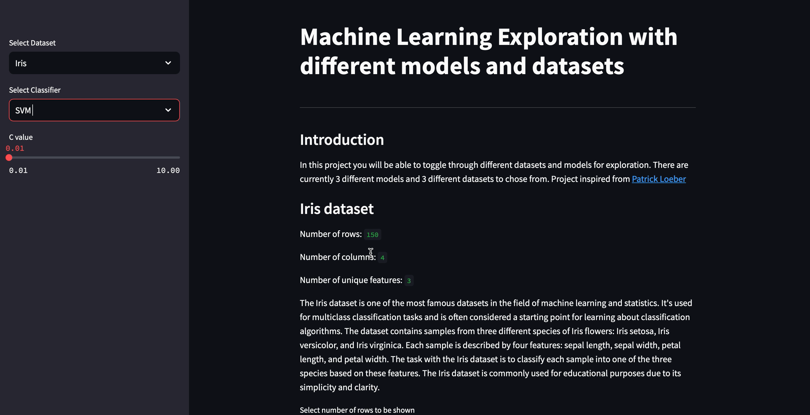
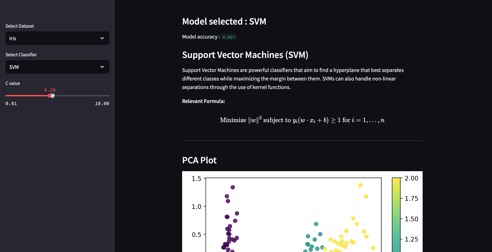

# Interactive-Machine-Learning-Dashboard-with-Streamlit-and-Docker

In this project you will be able to toggle through different datasets and models for exploration. There are currently 3 different models and 3 different datasets to chose from. Project inspired from [Patrick Loeber](https://www.youtube.com/watch?v=Klqn--Mu2pE&t=10s)

Datasets Included:

- Iris
- Breast Cancer
- Wine

Models used:

- KNN
  - Option to toggle K
- SVM
  - Option to toggle C
- Random Forest
  - Option to toggle max_depth and number of trees

